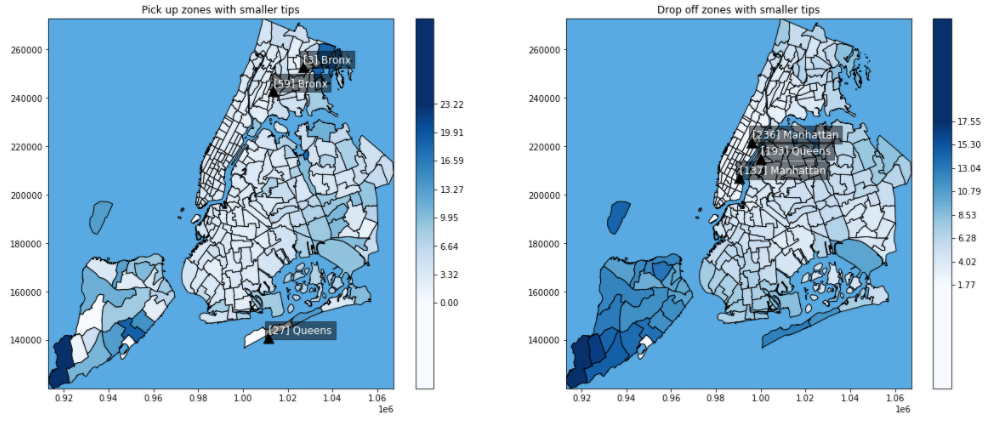

# NYC_Taxis
 Data analysis and modeling of tips of NYC taxis.
 
 ## Tip Amount

The tips in the NYC  yellow taxis were predicted with an accuracy of 99.7% using OLS regression and 99,9% using random forest. Both methods showed good performance, and minor problems were faced when modeling the data.

Here are some visualizations of the exploratory analysis. The main focus of the data exploration were the temporal and spatial trends in the data.
 
 
 

## Analysis

* [Data exploration and cleaning](https://github.com/DavidPayares/NYC_Taxis/blob/main/notebooks/Data_Exploration_and_Cleaning.ipynb): basic visualizations and datacleaning. Initial screening of variables and possible relations between them. Visualize in [nbviewer](https://nbviewer.jupyter.org/github/DavidPayares/NYC_Taxis/blob/main/notebooks/Data_Exploration_and_Cleaning.ipynb)
* [Data summary](https://github.com/DavidPayares/NYC_Taxis/blob/main/notebooks/Data_Summary.ipynb): most important insights into the data. Temporal and spatial visualizations. Further cleaning and generation of new candidate regressors.  Visualize in [nbviewer](https://nbviewer.jupyter.org/github/DavidPayares/NYC_Taxis/blob/main/notebooks/Data_Summary.ipynb)
* [Model building](https://github.com/DavidPayares/NYC_Taxis/blob/main/notebooks/Model_Building.ipynb): modeling of the tip amount. Use of two models, multiple linear regression and random forest. Visualize in [nbviewer](https://nbviewer.jupyter.org/github/DavidPayares/NYC_Taxis/blob/main/notebooks/Model_Building.ipynb)
